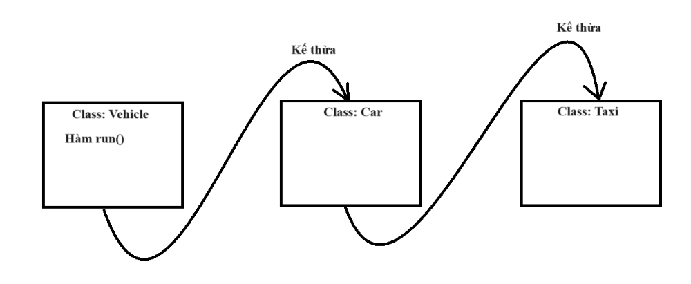

# Đa kế thừa
# Multi-level Inheritance

- Các bài trước là kế thừa từ đời cha sang đời con (2 đời) giống như trong cuộc sống thì sự kế thừa sẽ có thể tiếp diễn qua rất nhiều đời

- Trong lập trình OOP cũng vậy

 

 Trong hình minh họa:
 
- Từ đối tượng taxi có thể gọi được và sử dụng các tài nguyên được kế thừa của 2 lớp trước nó
- Các lớp con, cháu có thể Overiding các phương thức được kế thừa
